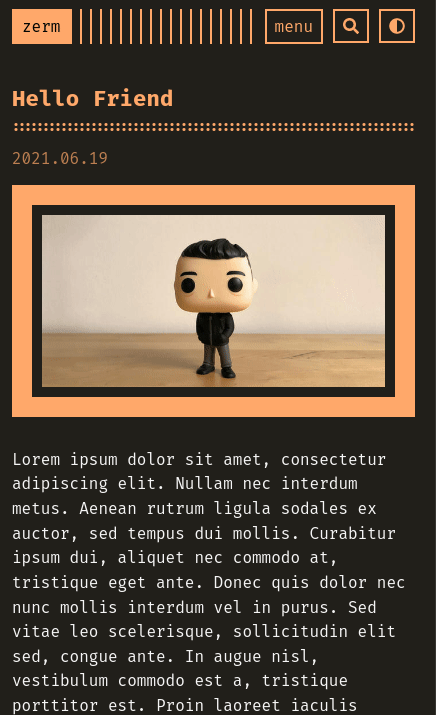
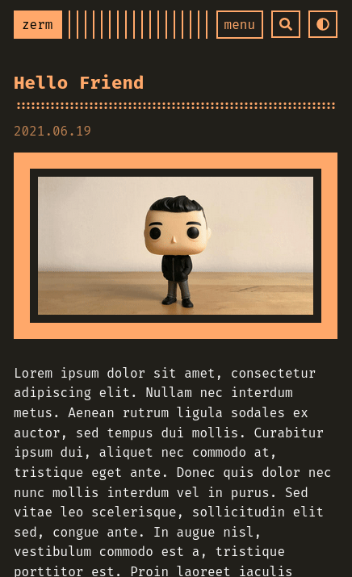

# zerm

my personal **fork** of a minimalist and dark theme for [Zola](https://getzola.org).


[**Live Preview!**](https://zwitt-zerm.netlify.app/)

Largely a port of Radek Kozieł's [Terminal
Theme](https://github.com/panr/hugo-theme-terminal) for Hugo.

## differences from original theme

This theme is largely true to the original by Radek, but there are some mild
differences. They are almost all stylistic in nature and are intended to
emphasize minimalism even more. Some of them are as follows:
- tags are now included in a post's meta data.
- categories are included in the taxonomy.
- bullet points have slightly more margin and different symbols for nesting.
- no comment support.

Some of these might be added later and [PR's are always
welcomed](https://github.com/ejmg/zerm/pulls).

## differences from ejmg port

- math typesetting support with KaTeX.
- copy URL to clipboard function at the end of the page.
- pagination at the end of the page.
- optional `support us` and `follow me` boxes at the end of the page.
- theme switcher for [dark/light mode](#colorschemes)
- [elasticlunr js search](#elasticlunr-search) implemented according to the [zola documentation](https://www.getzola.org/documentation/content/search/).
- search supports [multilanguage](#elasticlunr-multilang-support) thanks to [Lunr languages](https://github.com/weixsong/lunr-languages) integration.
- [duckduckgo search](#duckduckgo-search).
- highly optimized cover images for posts and lists.
- 404 template.

## configuration

Please follow the Zola documentation for [how to use a
theme](https://www.getzola.org/documentation/themes/installing-and-using-themes/#installing-a-theme).

In `config.toml`, you will find all values for customization that are supported
thus far have documentation explaining how they are used. If there is any confusion or something is not working as intended, [please open an issue](https://github.com/ejmg/zerm/issues)!

### colorschemes
You can add a button in the navbar to change the color palette from
a dark mode to a light mode with ease. I already wrote a light version
for the orange palette. You can see the button switching colors in the
gif below.



You can add your custom light colorscheme for any palette you want
like I did with the orange one on the `orange.scss` file in `sass/colors`:
```
:root {
  --accent: rgb(255,168,106);
  --accent-alpha-20: rgba(255, 168, 106, .2);
  --accent-alpha-70: rgba(255, 168, 106,.7);
  --background: #211f1a;
  --color: whitesmoke;
  --border-color: rgba(255, 255, 255, .1);
}

[data-theme="light"] {
  --accent: rgb(196, 125, 76);
  --accent-alpha-20: rgba(196, 125, 76, .2);
  --accent-alpha-70: rgba(196, 125, 76, .7);
  --background: #e4e3dd;
  --color: #110b11;
  --border-color: rgba(255, 255, 255, .1);
}
```

Enable this function with the `theme_switcher` parameter in
`[extra]` section of configuration file:

```
# Dark/Light mode switcher
theme_switcher = true
```

### elasticlunr search


Elasticlunr uses JS to search on an indexed version of the website;
you have to enable the generation of the index by zola with this
parameter:
```
# /config.toml

# Whether to build a search index to be used later on by a JavaScript library
build_search_index = true
```

#### elasticlunr multilang support
Multilanguage supported with those available:
* German
* French
* Spanish
* Italian
* Japanese
* Dutch
* Danish
* Portuguese
* Finnish
* Romanian
* Hungarian
* Russian
* Norwegian

Just select a `default_language` accordingly to make it work!

### duckduckgo search



If you don't want to make use of javascript on your website
or you really like DDG like me, you could set up a DuckDuckGo
search form.

## license

MIT. See `LICENSE.md` for more details.
